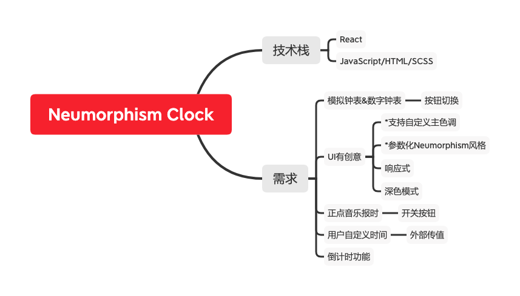
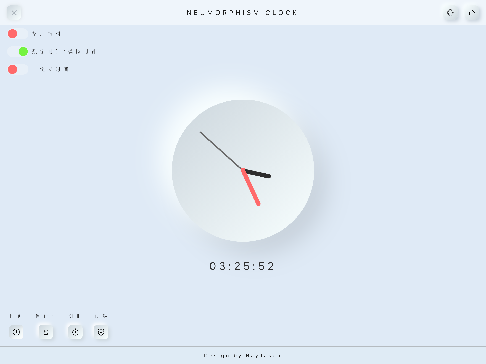
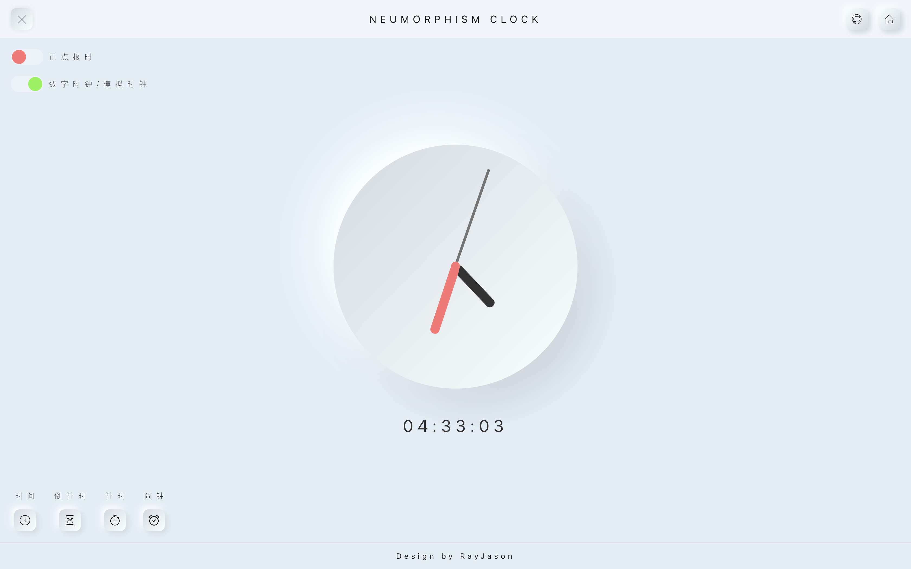

# Neumorphism_Clock

一个Neumorphism风格的时钟  
基于React框架开发的静态响应式网站

需求设计：
- 两种钟表选择：模拟钟表、数字钟表
- 正点音乐报时
- 用户自定义时间  
- 倒计时
- 参数化Neumorphism风格
- 自定义背景颜色
- 深色模式
- 响应式  

--- 
## 2020.10.14
- 重构模拟时钟，均改为外部传时间
- TODO 默认传入现在时间；指针动画
- 增加自定义时间选择器 样式未完善
- 增加自定义时间设置按钮，实现父子双向传值
- 功能栏增加点击切换选择的样式 TODO 功能页切换 考虑各个功能单独成页
- 子父传值可在父组件子标签内用箭头函数，不需要另外声明一个函数
- 认识React新版生命周期 _getDerivedStateFromProps_ 和 _componentDidUpdate_

---
## 2020.10.09
- 实现按钮功能开关：数字时钟和模拟时钟切换
- 实现点击设置按钮显示和隐藏设置功能
- 实现和实践父子传值、子父传值、兄弟传值
  - 父子传值：
    - 父：在子标签 _{值名={值}}_
    - 子：
      - 有状态组件：值=_this.props.值名_ 
      - 无状态组件：function name(_props_) 值=_props.值名_ 
  - 子父传值：
    - 子：
      - 有状态组件：_this.props.stateName(值)_
      - 无状态组件：
        - 组件括号加上props： function name(_props_) 
        - 内部调用的函数内：_props.stateName(值)_ 
    - 父：在子标签 _{stateName={this.setFunction}}_
      - _function setFunction(e) { console.log("接收到的值：",e) }_

---
## 2020.10.05
- 更新数字时钟
- 更新规划的功能入口、菜单、开关
- 按钮组件 button -> input type:checkbox 支持选择效果 更多拓展性
- 菜单按钮增加动画效果  

---  
## 2020.10.02  
- 实现指针时钟功能
- 时间刷新使用setTimeout而不是setinterval降低开支获得更好的性能  
- 按钮组件props增加超链接link、style
- 重构导航栏布局，增加跳转主页、Github入口
- css文件转为css module，学会使用css module应用全局和局部

---
## 2020.10.01   
- 实现按钮组件化 有状态组件->无状态组件  
[React创建组件的三种方式](https://www.cnblogs.com/wonyun/p/5930333.html )   
  
- 实现footer  
  

---
## 2020.09.30  
- 主页初见雏形；  
- 实现header：nav
- 探索解耦，尝试按钮组件化；

---

## 2020.09.29 
- 项目启动