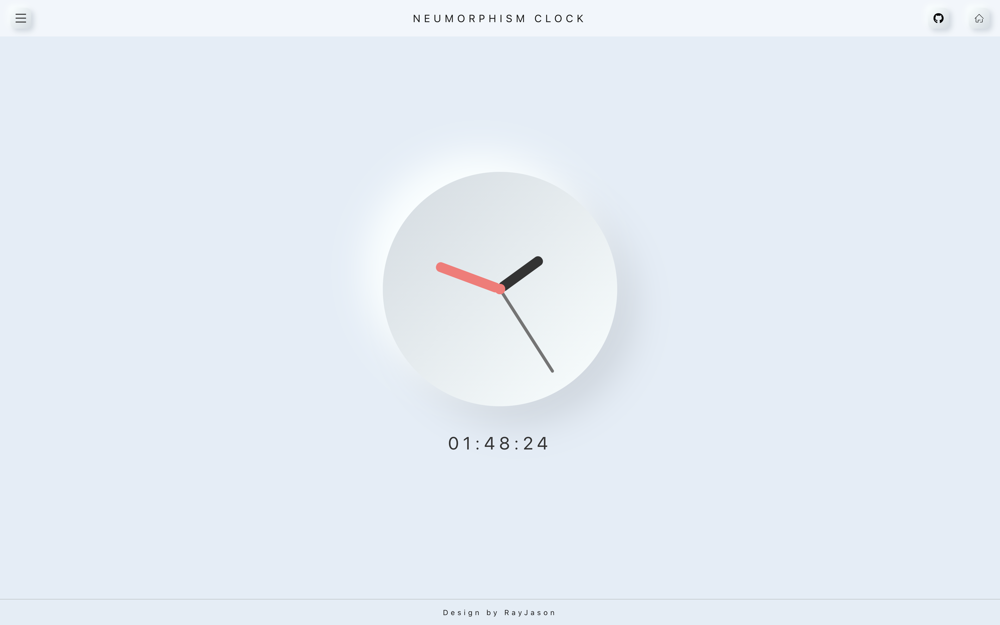
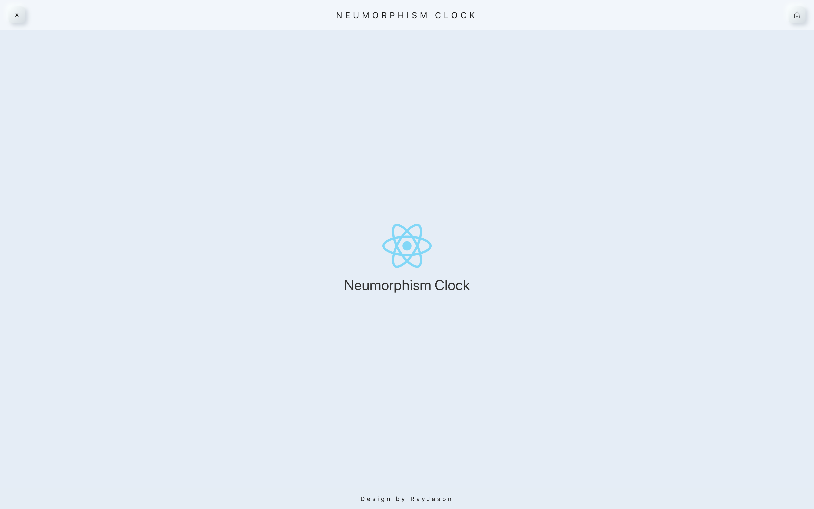

# Neumorphism_Clock

一个Neumorphism风格的时钟  
基于React框架开发的响应式网站

需求设计：
- 响应式
- 参数化生成Neumorphism风格
- 多种时钟风格
- 可切换背景颜色

---  
## 2020.10.02  
- 实现指针时钟功能
- 时间刷新使用setTimeout而不是setinterval降低开支获得更好的性能  
- 按钮组件props增加超链接link、style
- 重构导航栏布局，增加跳转主页、Github入口
- css文件转为css module，学会使用css module应用全局和局部
   

---
## 2020.10.01   
- 实现按钮组件化 有状态组件->无状态组件  
[React创建组件的三种方式](https://www.cnblogs.com/wonyun/p/5930333.html )   
  
- 实现footer  
  

---
## 2020.09.30  
- 主页初见雏形；  
- 实现header：nav
- 探索解耦，尝试按钮组件化；

---

## 2020.09.29 
- 项目启动