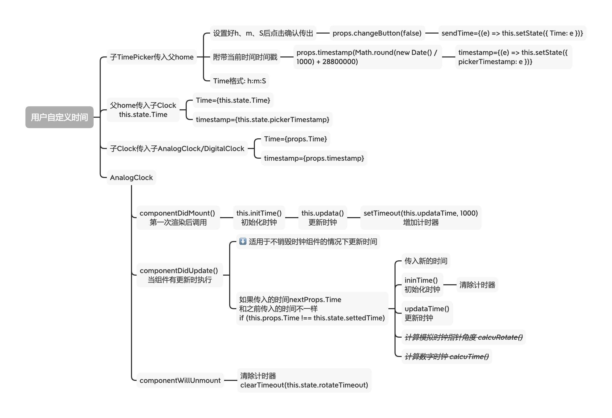
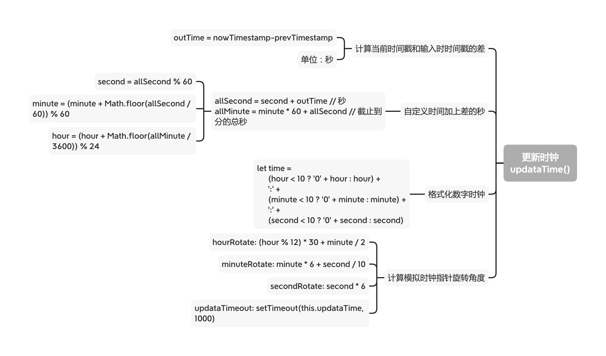

# Neumorphism_Clock

一个Neumorphism风格的时钟  
基于React框架开发的静态响应式网站

需求设计：
- 两种钟表选择：模拟钟表、数字钟表
- 正点音乐报时
- 用户自定义时间  
- 倒计时
- 参数化Neumorphism风格
- 自定义背景颜色
- 深色模式
- 响应式  


---
## 2020.10.16
- clock -> 有状态组件
- 数字时钟、模拟时钟 -> 无状态组件

---
## 2020.10.15
- 重构模拟时钟、数字时钟，均改为外部传时间，并附上时间戳
- 计算旋转角度需要留意js精度问题
- 自定义时间计算：
  - 通过现在的时间戳-设置时的时间戳的差（单位：秒），得出相对时差，即设置自定义时间到“现在”经过了多少秒n
    - `outTime = nowTimestamp - this.state.prevTimestamp`
  - 利用差值n秒：取模、相除向下取整等计算n秒后的h、m、S
```javascript
let allSecond = second + outTime // 秒  
let allMinute = minute * 60 + allSecond // 截止到分的总秒 

second = allSecond % 60
minute = (minute + Math.floor(allSecond / 60)) % 60
hour = (hour + Math.floor(allMinute / 3600)) % 24
```
  - 利用计算出来的h、m、S计算指针旋转的角度
```javascript
hourRotate: (hour % 12) * 30 + minute / 2,
minuteRotate: minute * 6 + second / 10,
secondRotate: second * 6,
```
- 默认当前北京时间：
  - 当前北京时间戳nowTimestamp = 标准时间戳 + 8小时（换算毫秒），未传入自定义时间时相对时差为0，因此显示的时间就是现在时间戳显示的时间。
- 绑定this的两种写法：
  - 函数使用箭头函数 `functionName = () => {}`
  - 函数不用箭头函数，在constructor注册 ` constructor() { this.functionName = this.functionName.bind(this) } `




--- 
## 2020.10.14
- 重构模拟时钟，均改为外部传时间
- TODO 默认传入现在时间；指针动画
- 增加自定义时间选择器 样式未完善
- 增加自定义时间设置按钮，实现父子双向传值
- 功能栏增加点击切换选择的样式 TODO 功能页切换 考虑各个功能单独成页
- 子父传值可在父组件子标签内用箭头函数，不需要另外声明一个函数
- 认识React新版生命周期 _getDerivedStateFromProps_ 和 _componentDidUpdate_


---
## 2020.10.09
- 实现按钮功能开关：数字时钟和模拟时钟切换
- 实现点击设置按钮显示和隐藏设置功能
- 实现和实践父子传值、子父传值、兄弟传值
  - 父子传值：
    - 父：在子标签 _{值名={值}}_
    - 子：
      - 有状态组件：值=_this.props.值名_ 
      - 无状态组件：function name(_props_) 值=_props.值名_ 
  - 子父传值：
    - 子：
      - 有状态组件：_this.props.stateName(值)_
      - 无状态组件：
        - 组件括号加上props： function name(_props_) 
        - 内部调用的函数内：_props.stateName(值)_ 
    - 父：在子标签 _{stateName={this.setFunction}}_
      - _function setFunction(e) { console.log("接收到的值：",e) }_

---
## 2020.10.05
- 更新数字时钟
- 更新规划的功能入口、菜单、开关
- 按钮组件 button -> input type:checkbox 支持选择效果 更多拓展性
- 菜单按钮增加动画效果  


---  
## 2020.10.02  
- 实现指针时钟功能
- 时间刷新使用setTimeout而不是setinterval降低开支获得更好的性能  
- 按钮组件props增加超链接link、style
- 重构导航栏布局，增加跳转主页、Github入口
- css文件转为css module，学会使用css module应用全局和局部


---
## 2020.10.01   
- 实现按钮组件化 有状态组件->无状态组件  
[React创建组件的三种方式](https://www.cnblogs.com/wonyun/p/5930333.html )   
  
- 实现footer  
  


---
## 2020.09.30  
- 主页初见雏形；  
- 实现header：nav
- 探索解耦，尝试按钮组件化；

---

## 2020.09.29 
- 项目启动